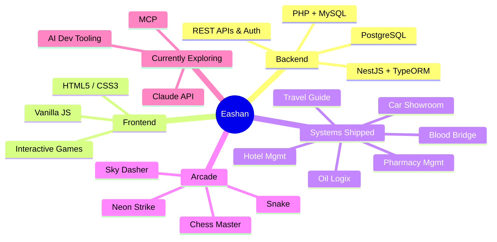

<div align="center">


<p>
<a href="https://mireashanzaman.github.io/MirEashanZaman-Portfolio/"></a>
<a href="https://www.linkedin.com/in/mir-eashan-zaman-319474343"></a>
<a href="https://github.com/MirEashanZaman"></a>
</p>

</div>

<br>

```ansi
┌─[eashan@aiub]─[~]
└──╼ $ whoami --verbose

  name        : Mir Eashan Zaman
  role        : Full-Stack Developer · CSE Student @ AIUB
  location    : Dhaka, Bangladesh
  stack       : PHP · MySQL · JS · C# · NestJS · TypeORM
  certs       : 70+ (Anthropic · Microsoft · Google · Oracle)
  exploring   : Claude API · MCP · AI-assisted dev tooling
  side_quest  : shipping browser games in vanilla JS
  status      : online, shipping code, probably debugging something
```

<br>

## 🧬 How It All Connects



<br>

## 🛠️ Tech Stack

<p align="center">
  
</p>

<br>

## 📊 GitHub Stats

<p align="center">
  
</p>

<br>

## 💼 Management Systems & Projects

<details open>
<summary><b>🩸 Blood Bridge</b> — Donor & blood bank management hub</summary>
<br>

`PHP` `MySQL` — [View Repo](https://github.com/MirEashanZaman/Blood_Bridge)
</details>

<details>
<summary><b>💊 Pharmacy Management System</b> — Inventory, billing & stock tracking</summary>
<br>

`PHP` `MySQL` — [View Repo](https://github.com/MirEashanZaman/Pharmacy_Management_System)
</details>

<details>
<summary><b>🏨 Hotel Management System</b> — Multi-role booking & payment platform</summary>
<br>

`PHP` `MySQL` — [View Repo](https://github.com/MirEashanZaman/Hotel-Management-System)
</details>

<details>
<summary><b>🚗 Car Showroom Management System</b> — Dealership CRM</summary>
<br>

`C#` `SQL Server` — [View Repo](https://github.com/MirEashanZaman/Car-Showroom-Management-System)
</details>

<details>
<summary><b>🛢️ Oil Logix</b> — Supply chain client portal + backend API</summary>
<br>

`JS` `NestJS` `TypeORM` `PostgreSQL` `JWT` — Google Maps order tracking, bulk price negotiation
[Frontend](https://github.com/MirEashanZaman/Oil-Supply-And-Delivery-Management-System) · [Backend API](https://github.com/MirEashanZaman/Oil-Supply-Delivery-Management-System-Backend)
</details>

<details>
<summary><b>✈️ Travel Guide</b> — Visual journey planner & destination guide</summary>
<br>

`JS` `HTML/CSS` — [View Repo](https://github.com/MirEashanZaman/Travel-Guide)
</details>

<details>
<summary><b>♟️ Chess Master</b> — Minimax AI, multiple themes, Lichess SVG pieces</summary>
<br>

`Vanilla JS` `HTML5` — [Play Now](https://chess-master-play.netlify.app/) · [View Repo](https://github.com/MirEashanZaman/Chess-Game)
</details>

<br>

## 🎮 Arcade Zone — Play Instantly

<p align="center">
  <a href="https://neon-strike01.netlify.app"></a>
  <a href="https://sky-dasher.netlify.app"></a>
  <a href="https://snake-game-nostalgia.netlify.app"></a>
  <a href="https://chess-master-play.netlify.app/"></a>
</p>

<br>

## 📜 Certifications (70+ total)

<p align="center">
<br><br>
<br><br>
<br><br>

</p>

<br>

<div align="center">

### 💭 "Ship it, debug it, ship it better."

</div>


