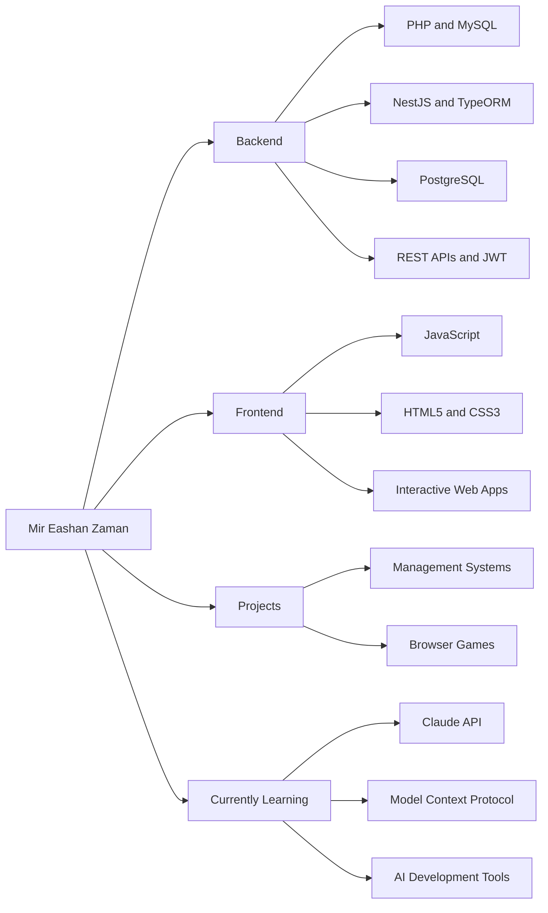

````md
<div align="center">


<br/>


<br/><br/>

<a href="https://mireashanzaman.github.io/MirEashanZaman-Portfolio/">
  
</a>

<a href="https://www.linkedin.com/in/mir-eashan-zaman-319474343">
  
</a>

<a href="https://github.com/MirEashanZaman">
  
</a>

</div>

<br/>

# 👋 About Me

```text
$ whoami

Name       : Mir Eashan Zaman
Role       : Full-Stack Developer and CSE Student
Location   : Dhaka, Bangladesh

Backend    : PHP, MySQL, NestJS, TypeORM, PostgreSQL
Frontend   : JavaScript, HTML5, CSS3
Languages  : PHP, JavaScript, C#
Focus      : REST APIs, authentication, database systems
Exploring  : Claude API, MCP, AI-assisted development
Building   : Management systems and browser games
Status     : Building, testing, debugging, and shipping
````

I build complete web applications, from relational database design and backend APIs to responsive interfaces and interactive browser experiences.

My work includes business management systems, multi-role platforms, delivery systems, REST APIs, and browser games built with vanilla JavaScript.

<br/>

# 🧬 Development Map



<br/>

# 🛠️ Tech Stack

<div align="center">


</div>

<br/>

# 📊 GitHub Activity

<div align="center">


</div>

<br/>

# 💼 Featured Projects

<table>

<tr>

<td width="50%" valign="top">

### 🩸 Blood Bridge

A donor and blood bank management platform designed to organize donor information and support blood availability workflows.

**Tech Stack**

`PHP` `MySQL`

<br/>

<a href="https://github.com/MirEashanZaman/Blood_Bridge">


</a>

</td>

<td width="50%" valign="top">

### 💊 Pharmacy Management System

A pharmacy platform with inventory management, billing, medicine tracking, and stock monitoring.

**Tech Stack**

`PHP` `MySQL`

<br/>

<a href="https://github.com/MirEashanZaman/Pharmacy_Management_System">


</a>

</td>

</tr>

<tr>

<td width="50%" valign="top">

### 🏨 Hotel Management System

A multi-role hotel platform supporting bookings, customer workflows, and payment management.

**Tech Stack**

`PHP` `MySQL`

<br/>

<a href="https://github.com/MirEashanZaman/Hotel-Management-System">


</a>

</td>

<td width="50%" valign="top">

### 🚗 Car Showroom Management

A dealership management system for handling customer information, vehicles, and showroom operations.

**Tech Stack**

`C#` `SQL Server`

<br/>

<a href="https://github.com/MirEashanZaman/Car-Showroom-Management-System">


</a>

</td>

</tr>

<tr>

<td width="50%" valign="top">

### 🛢️ Oil Supply and Delivery

A supply-chain platform with a client portal, backend API, order workflows, location features, and bulk-price negotiation.

**Tech Stack**

`JavaScript` `NestJS` `TypeORM` `PostgreSQL` `JWT`

<br/>

<a href="https://github.com/MirEashanZaman/Oil-Supply-And-Delivery-Management-System">


</a>

<a href="https://github.com/MirEashanZaman/Oil-Supply-Delivery-Management-System-Backend">


</a>

</td>

<td width="50%" valign="top">

### ✈️ Travel Guide

A visual destination guide and journey-planning experience for exploring travel locations.

**Tech Stack**

`JavaScript` `HTML5` `CSS3`

<br/>

<a href="https://github.com/MirEashanZaman/Travel-Guide">


</a>

</td>

</tr>

</table>

<br/>

# 🎮 Arcade Zone

<div align="center">

### Interactive browser games built with Vanilla JavaScript

<br/>

<a href="https://neon-strike01.netlify.app">


</a>

<a href="https://sky-dasher.netlify.app">


</a>

<a href="https://snake-game-nostalgia.netlify.app">


</a>

<a href="https://chess-master-play.netlify.app/">


</a>

</div>

<br/>

## ♟️ Chess Master

A browser-based chess game featuring multiple themes, SVG chess pieces, and a Minimax-powered AI opponent.

**Tech Stack**

`Vanilla JavaScript` `HTML5` `CSS3` `Minimax`

<br/>

<div align="center">

<a href="https://chess-master-play.netlify.app/">


</a>

<a href="https://github.com/MirEashanZaman/Chess-Game">


</a>

</div>

<br/>

# 📜 Certifications

<div align="center">

### 70+ completed courses and certifications

AI, cloud, programming, developer tools, and modern software development.

<br/>


<br/><br/>


<br/><br/>


<br/><br/>


</div>

<br/>

# 🚀 Currently Exploring

```text
Claude API
Model Context Protocol (MCP)
AI-assisted development workflows
Agentic development tools
Modern backend architecture
```

<br/>

<div align="center">

## 💭 “Build it. Test it. Improve it. Ship it.”


</div>

<br/>


````

The key correction is this section:

```md

````

